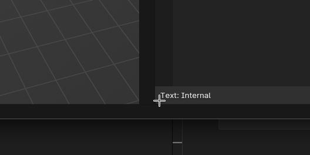
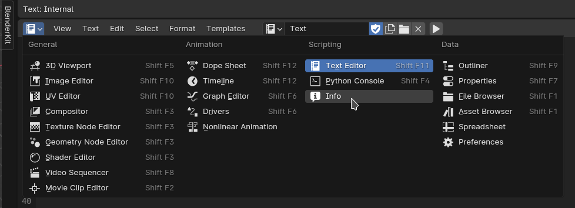
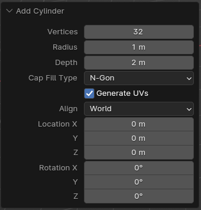

# VMBO on stage


Hieronder volgt 


## Voorbereiding
1. Download en installeer Blender vanaf https://www.blender.org/
2. Open Blender
3. Click splashscreen weg
4. Ga naar Tab scripting
5. Sluit de overbodige deelvensters door in de header van het deelvenster op de rechtermuis te clicken en dan `close area`
6. Click op `new`  
Het scherm ziet er ongeveer als volgt uit

7. typ in het text/script/python venster aan de rechterkant, het volgende:  
    ```
    import bpy

    if __name__ == "__main__":
        print('hello world')
    ```
    _Als Blender nu vanuit de commandline opgestart wordt, het bestand  geopent en het script uitgevoerd wordt, zal er op de commandline hello world verschijnen.  
    Dit kan alleen met een omweg in Blender zelf getoond worden en dat is voor nu een brug te ver_

## Inlezen van een bestand
1. Het openen en lezen van het bestand:
    ```
    sheet = open('C:\Users\berend\Desktop\cijfers.csv', 'r')
    ```
2. Het 'opdelen' van het bestand per regel
    ```
    regels = sheet.readlines()
    ```
3. Een count en een loop over de regels
    ```
    regelnr = 0
    for regel in regels:
        regelnr += 1
        print("Regel {}: {}".format(regelnr, regel.strip()))
    ```
In totaal hebben we dan dus:
```
import bpy

if __name__ == "__main__":
    sheet = open('C:\Users\berend\Desktop\cijfers.csv', 'r')
    regels = sheet.readlines()

    regelnr = 0
    for regel in regels:
        regelnr += 1
        print("Regel {}: {}".format(regelnr, regel.strip()))
```

## Inlezen eerste regel : vakken

1. Check of we de eerste regel te pakken hebben
    ```
    if regelnr == 1:
    ```
2. Het 'opdelen' van de regel in vakken
    ```
        vakken = regel.split(";")
    ```
3. Loop over de vakken
    ```
        vaknr = 0
        for vak in vakken:
            vaknr += 1
            if vaknr > 1:
                print("Vak {}: {}".format(vaknr, vak.strip()))
    ```
In totaal hebben we dan dus:
```
import bpy

if __name__ == "__main__":
    sheet = open('C:\Users\berend\Desktop\cijfers.csv', 'r')
    regels = sheet.readlines()

    regelnr = 0
    for regel in regels:
        regelnr += 1
        if regelnr == 1:
            vakken = regel.split(";")
            vaknr = 0
            for vak in vakken:
                vaknr += 1
                if vaknr > 1:
                    print("Vak {}: {}".format(vaknr, vak.strip()))
```

## Herschrijven eerste regel

1. Haal de eerste regel uit de lijst met regels
    ```
    regelVakken = regels[0]
    ```
2. Splits de regel in vakken door ; en loop daaroverheen vanaf het element met index 0
    ```
    for vak in regelVakken.split(";")[1:]:
        print(vak)
    ```
In totaal hebben we dan dus:
```
import bpy

if __name__ == "__main__":
    sheet = open('C:\Users\berend\Desktop\cijfers.csv', 'r')
    regels = sheet.readlines()

    regelVakken = regels[0]
    for vak in regelVakken.split(";")[1:]:
        print(vak)
```

## Invoegen tekst
1. We maken een methode
    ```
    def invoegenTekst(inTeVoegenTekst):
        print(inTeVoegenTekst)
    ```
2. We meken een object text in Blender
    ```
    def invoegenTekst(inTeVoegenTekst, naamTekst):
        tekst = bpy.data.curves.new(naamTekst, "FONT")
        obj = bpy.data.objects.new(naamTekst, tekst)
        bpy.context.collection.objects.link(obj)
        tekst.body = inTeVoegenTekst
    ```
 
> ### _Reset_
> _Omdat we de methodes vaker aanroepen nu we aan het ontwikkelen zijn, worden er elke keer extra objecten aangemaakt. Om dit te voorkomen maken we een kleine methode die onze workspace elke keer reset. Maak de volgende methode aan en roep deze elke keer als eerste aan_
>
> _De methode:_
> ```
> def reset():
>     objs = bpy.data.objects
>     with bpy.context.temp_override(selected_objects=objs):
>         bpy.ops.object.delete()
> ```
> _De aanroep:_
> ```
> if __name__ == "__main__":
>     reset()
> ```
3. De tekst op de juiste locatie zetten
    1. Voeg een extra argument toe aan de methode met default waarde
    ```
    def invoegenTekst(inTeVoegenTekst, naamTekst, posY = 0):
        ...
        obj.location = (0, posY, 0)
    ```
    2. Geef het extra argument mee
    ```
    vaknr = 0
        for vak in regelVakken.split(";")[1:]:
            vaknr += 1
            invoegenTekst(vak, vak, vaknr)
    ```
In totaal hebben we dan dus:
```
import bpy

def invoegenTekst(inTeVoegenTekst, naamTekst, posY = 1):
    tekst = bpy.data.curves.new(naamTekst, "FONT")
    obj = bpy.data.objects.new(naamTekst, tekst)
    obj.location = (0, posY, 0)
    bpy.context.collection.objects.link(obj)
    tekst.body = inTeVoegenTekst
    
def reset():
    objs = bpy.data.objects
    with bpy.context.temp_override(selected_objects=objs):
        bpy.ops.object.delete()

if __name__ == "__main__":
    reset()
    sheet = open('/home/berend/Graphics/blender/models/_school/cijfers.csv', 'r')
    regels = sheet.readlines()
    
    regelVakken = regels[0]
    vaknr = 0
    for vak in regelVakken.split(";")[1:]:
        vaknr += 1
        invoegenTekst(vak, vak, vaknr)
```
## Invoegen tekst & cijfers vanuit 1 regel
1. Voor de volgende regels maken weer een loopje en ook deze regel moeten we splitten
    ```
        for regelLeerlingEnCijfers in regels[1:]:
            leerlingEnCijfers = regelLeerlingEnCijfers.split(";")
            leerling = leerlingEnCijfers[0]
            invoegenTekst(leerling, leerling)
    ```
2. Tekst positioneren
    1. Methode invoegenTekst aanpassen
        ```
            def invoegenTekst(inTeVoegenTekst, naamTekst, posY = 1, posX = 0):
                ...
                obj.location = (posX, posY, 0)
        ```
    2. Aanroep van de methode invoegenTekst wijzigen
        ```
            leerlingNr = 0
            for regelLeerlingEnCijfers in regels[1:]:
                leerlingNr += 1
                ...
                invoegenTekst(leerling, leerling, 1, leerlingNr*-1)
        ```
3. Tekst roteren
    1. Methode invoegenTekst aanpassen
        ```
        def invoegenTekst(inTeVoegenTekst, naamTekst, posY = 1, posX = 0, rotZ=0):
            ...
            obj.rotation_mode = 'XYZ'
            obj.rotation_euler = (0, 0, rotZ)
        ```
    2. Aanroep van de methode invoegenTekst wijzigen
        ```
            invoegenTekst(leerling, leerling, 1, leerlingNr*-1, 1.5708)
        ```

        > Voor meer informatie over het getal 1.5708 zie...  
        > [Hoeken van Euler](https://nl.wikipedia.org/wiki/Hoeken_van_Euler)  
        > :smile:

4. Tekst uitlijnen
    1. Methode invoegenTekst aanpassen
        ```
        def invoegenTekst(inTeVoegenTekst, naamTekst, posY = 1, posX = 0, rotZ=0, align = "LEFT"):
            ...
            tekst.body = inTeVoegenTekst
            tekst.align_x = align
        ```
    2. Aanroep van de methode invoegenTekst wijzigen
        ```
            invoegenTekst(leerling, leerling, 1, leerlingNr*-1, 1.5708, "RIGHT")
        ```
5.  Loop over de rest van de regel om de cijfers eruit te krijgen

    ```
    for cijfer in leerlingEnCijfers[1:]:
        print(cijfer)
    ```
6. Maak een nieuwe methode om iets met de cijfers te doen
    ```
    def insertCijfer(cijferTekst):
        print(cijfer)
    ```

    ### Python commando' s in Blender achterhalen
    > Nu willen wel een cylinder invoegen. Om erachter te komen hoe dit in Blender te doen is via Python gebruiken we het volgende trucje:
    > Ga met de muisaanwijzer naar een hoek van het pythonscherm in Blender. De muisaanwijzer wijzigt in een kruis. Zie afbeelding:
    > 
    > 
    >
    > Houdt de linkermuisknop ingedrukt en sleep omhoog. :tada: nieuw deelvenster. 
    > In dat nieuwe deelvenster clicken we op de dropdown in de linkerbovenhoek (kladblokje). En daarna clicken we op "info". Zie afbeelding:
    > 
    > 
    >
    > In dat venster druk :a: om alles te selecteren en op :x: om alles te verwijderen.
    >
    > Alles wat we vanaf nu gaan doen wordt gelogd in het info venster.
    > 
    > 1. Ga in het 3D venster staan en druk op shift+:a: 
    > 2. In het contextmenu click je op _mesh -> cylinder_ (niet op mesh clicken maar alleen op cylinder)
    > 3. Linksonder het scherm komt een klein ingeklapt schermpje, wat je open kun klikken, verander de waardes Radius en Depth. (zie afbeelding hieronder)
    > 4. In het info scherm staat nu het python commando om een cylinder in te voegen. 
    > 5. Selecteer en copy paste in onze methode  
    > 

7. Invoegen cylinder per cijfer
    ```
    def insertCijfer(cijferTekst):
        bpy.ops.mesh.primitive_cylinder_add(radius=0.99, depth=1.99, enter_editmode=False, align='WORLD', location=(0, 0, 0), scale=(1, 1, 1))
    ```
    Nu wordt er per cijfer een cylinder toegevoegd. Dit zie je niet omdat ze allemaal even groot zijn en op dezelfde plek staan.

8. Wijzigen radius en hoogte
    Wijzig de radius op 0.3 (of wat je zelf maar mooi vindt)
    Wijzig de depth (=hoogte) in _cijferTekst_
    ```
    def insertCijfer(cijferTekst):
        bpy.ops.mesh.primitive_cylinder_add(radius=0.3, depth=cijferTekst, enter_editmode=False, align='WORLD', location=(0, 0, 0), scale=(1, 1, 1))
    ```
    En dat werkt niet omdat we, als het bestand wordt ingelezen de cijfers als tekst inlezen en de hoogte een _float_ verwacht.
    > ### Variabelen
    > [Meer over variabelen binnen python](https://www.w3schools.com/python/python_datatypes.asp)   
    > 
    Door de tekst cijferTekst te wijzigen in een float door float(cijferTekst)
    ```
    def insertCijfer(cijferTekst):
        cijfer = float(cijferTekst)
        bpy.ops.mesh.primitive_cylinder_add(radius=0.3, depth=cijfer, enter_editmode=False, align='WORLD', location=(0, 0, 0), scale=(1, 1, 1))
    ```
9. Cylinder positioneren
    1. Per leerling
        1. Aanpassen methode
            ```
            def insertCijfer(cijferTekst, behorendBijLeerling):
                cijfer = float(cijferTekst)
                bpy.ops.mesh.primitive_cylinder_add(radius=0.3, 
                                                    depth=cijfer, 
                                                    enter_editmode=False, 
                                                    align='WORLD', 
                                                    location=(behorendBijLeerling * -1, 0, 0), 
                                                    scale=(1, 1, 1))
            ```
        2. Aanroep methode
            ```
            insertCijfer(cijfer, leerlingNr)
            ```
    2. Per vak
        1. Aanpassen methode
            ```
            def insertCijfer(cijferTekst, behorendBijLeerling, cijferNr):
                cijfer = float(cijferTekst)
                bpy.ops.mesh.primitive_cylinder_add(radius=0.3, 
                                                    depth=cijfer, 
                                                    enter_editmode=False, 
                                                    align='WORLD', 
                                                    location=(behorendBijLeerling * -1, cijferNr, 0), 
                                                    scale=(1, 1, 1))
            ```
        2. Aanroep methode
            ```
            cijferNr = 0
            for cijfer in leerlingEnCijfers[1:]:
                cijferNr += 1
                insertCijfer(cijfer, leerlingNr, cijferNr)
            ```

    3. Uitlijnen op de juiste hoogte   
        ```
        def insertCijfer(cijferTekst, behorendBijLeerling, cijferNr):
            cijfer = float(cijferTekst)
            bpy.ops.mesh.primitive_cylinder_add(radius=0.3, 
                                                depth=cijfer, 
                                                enter_editmode=False, 
                                                align='WORLD', 
                                                location=(behorendBijLeerling * -1, cijferNr, cijfer / 2), 
                                                scale=(1, 1, 1))
        ```
    4. Bijschaven
        ```
        def insertCijfer(cijferTekst, behorendBijLeerling, cijferNr):
            cijfer = float(cijferTekst) / 3
            bpy.ops.mesh.primitive_cylinder_add(radius=0.3, 
                                                depth=cijfer, 
                                                enter_editmode=False, 
                                                align='WORLD', 
                                                location=((0.5 + behorendBijLeerling) * -1, cijferNr + .5, cijfer / 2), 
                                                scale=(1, 1, 1))
        ```
    5. Naamgeving
        1. Aanpassen methode
            ```
            def insertCijfer(cijferTekst, behorendBijLeerling, cijferNr, naam):
                cijfer = float(cijferTekst) / 3
                bpy.ops.mesh.primitive_cylinder_add(radius=0.3, 
                                                    depth=cijfer, 
                                                    enter_editmode=False, 
                                                    align='WORLD', 
                                                    location=((0.5 + behorendBijLeerling) * -1, cijferNr + .5, cijfer / 2), 
                                                    scale=(1, 1, 1))
                bpy.context.active_object.name = naam
                obj = bpy.data.objects[naam]
            ```
        2. Aanroep methode
            ```
            naam = leerling + "_" + regelVakken.split(";")[cijferNr]
            insertCijfer(cijfer, leerlingNr, cijferNr, naam)
            ```
    In totaal hebben we dan dus:
```
import bpy

def invoegenTekst(inTeVoegenTekst, naamTekst, posY = 1, posX = 0, rotZ=0, align = "LEFT"):
    tekst = bpy.data.curves.new(naamTekst, "FONT")
    obj = bpy.data.objects.new(naamTekst, tekst)
    obj.location = (posX, posY, 0)
    obj.rotation_mode = 'XYZ'
    obj.rotation_euler = (0, 0, rotZ)
    bpy.context.collection.objects.link(obj)
    tekst.body = inTeVoegenTekst
    tekst.align_x = align
    
def reset():
    objs = bpy.data.objects
    with bpy.context.temp_override(selected_objects=objs):
        bpy.ops.object.delete()

def insertCijfer(cijferTekst, behorendBijLeerling, cijferNr, naam):
    cijfer = float(cijferTekst) / 3
    bpy.ops.mesh.primitive_cylinder_add(radius=0.3, 
                                        depth=cijfer, 
                                        enter_editmode=False, 
                                        align='WORLD', 
                                        location=((0.5 + behorendBijLeerling) * -1, cijferNr + .5, cijfer / 2), 
                                        scale=(1, 1, 1))
    bpy.context.active_object.name = naam
    obj = bpy.data.objects[naam]

if __name__ == "__main__":
    reset()
    sheet = open('/home/berend/Graphics/blender/models/_school/cijfers.csv', 'r')
    regels = sheet.readlines()
    
    regelVakken = regels[0]
    vaknr = 0
    for vak in regelVakken.split(";")[1:]:
        vaknr += 1
        invoegenTekst(vak, vak, vaknr)

    leerlingNr = 0
    for regelLeerlingEnCijfers in regels[1:]:
        leerlingNr += 1
        leerlingEnCijfers = regelLeerlingEnCijfers.split(";")
        leerling = leerlingEnCijfers[0]
        invoegenTekst(leerling, leerling, 1, leerlingNr*-1, 1.5708, "RIGHT")
        
        cijferNr = 0
        for cijfer in leerlingEnCijfers[1:]:
            cijferNr += 1
            naam = leerling + "_" + regelVakken.split(";")[cijferNr]
            insertCijfer(cijfer, leerlingNr, cijferNr, naam)yc
```
## Extra's 

### 3D Teksten
Om de teksten wat meer te laten opvallen, gaan we ze wat dikte geven
Dit doen we door in de methode `invoegenTekst` onderaan het volgende toe te voegen:
```
    tekst.extrude = 0.1
```

### Kleur

1. Om kleuren toe te kunnen toevoegen voegen we de volgende methode toe
    ```
    def createMaterial():
        mat = bpy.data.materials.new(name="Material")
        mat.use_nodes = True
        node_tree = mat.node_tree
        nodes = node_tree.nodes
        bsdf = nodes.get("Principled BSDF") 
        bsdf.inputs["Base Color"].default_value = (1, 0, 1, 1)
        return mat
    ```
2. Aanroepen van de methode
    ```
    obj.data.materials.append(createMaterial())
    ```
    Dit kan zowel binnen de methode `invoegenTekst` als de methode `insertCijfer`

3. Variabel maken van de kleuren  
    ```
    def createMaterial(r, g, b):
        ...
        bsdf.inputs["Base Color"].default_value = (r, g, b, 1)
    ```
    Tekst een vast kleur
    ```
    obj.data.materials.append(createMaterial(0, 0, 1))
    ```
    Cijfers een variablele kleur
    ```
    obj.data.materials.append(createMaterial(1-(cijfer/3), 0+(cijfer/9), 0))
    ```

In totaal hebben we dan:
```
import bpy

def invoegenTekst(inTeVoegenTekst, naamTekst, posY = 1, posX = 0, rotZ=0, align = "LEFT"):
    tekst = bpy.data.curves.new(naamTekst, "FONT")
    obj = bpy.data.objects.new(naamTekst, tekst)
    obj.location = (posX, posY, 0)
    obj.rotation_mode = 'XYZ'
    obj.rotation_euler = (0, 0, rotZ)
    bpy.context.collection.objects.link(obj)
    tekst.body = inTeVoegenTekst
    tekst.align_x = align
    tekst.extrude = 0.1
    obj.data.materials.append(createMaterial(0, 0, 1))
    
def createMaterial(r, g, b):
    mat = bpy.data.materials.new(name="Material")
    mat.use_nodes = True
    node_tree = mat.node_tree
    nodes = node_tree.nodes
    bsdf = nodes.get("Principled BSDF") 
    bsdf.inputs["Base Color"].default_value = (r, g, b, 1)
    return mat
    
def reset():
    objs = bpy.data.objects
    with bpy.context.temp_override(selected_objects=objs):
        bpy.ops.object.delete()

def insertCijfer(cijferTekst, behorendBijLeerling, cijferNr, naam):
    cijfer = float(cijferTekst) / 3
    bpy.ops.mesh.primitive_cylinder_add(radius=0.3, 
                                        depth=cijfer, 
                                        enter_editmode=False, 
                                        align='WORLD', 
                                        location=((0.5 + behorendBijLeerling) * -1, cijferNr + .5, cijfer / 2), 
                                        scale=(1, 1, 1))
    bpy.context.active_object.name = naam
    obj = bpy.data.objects[naam]
    obj.data.materials.append(createMaterial(1-(cijfer/3), 0+(cijfer/9), 0))

if __name__ == "__main__":
    reset()
    sheet = open('/home/berend/Graphics/blender/models/_school/cijfers.csv', 'r')
    regels = sheet.readlines()
    
    regelVakken = regels[0]
    vaknr = 0
    for vak in regelVakken.split(";")[1:]:
        vaknr += 1
        invoegenTekst(vak, vak, vaknr)

    leerlingNr = 0
    for regelLeerlingEnCijfers in regels[1:]:
        leerlingNr += 1
        leerlingEnCijfers = regelLeerlingEnCijfers.split(";")
        leerling = leerlingEnCijfers[0]
        invoegenTekst(leerling, leerling, 1, leerlingNr*-1, 1.5708, "RIGHT")
        
        cijferNr = 0
        for cijfer in leerlingEnCijfers[1:]:
            cijferNr += 1
            naam = leerling + "_" + regelVakken.split(";")[cijferNr]
            insertCijfer(cijfer, leerlingNr, cijferNr, naam)
```